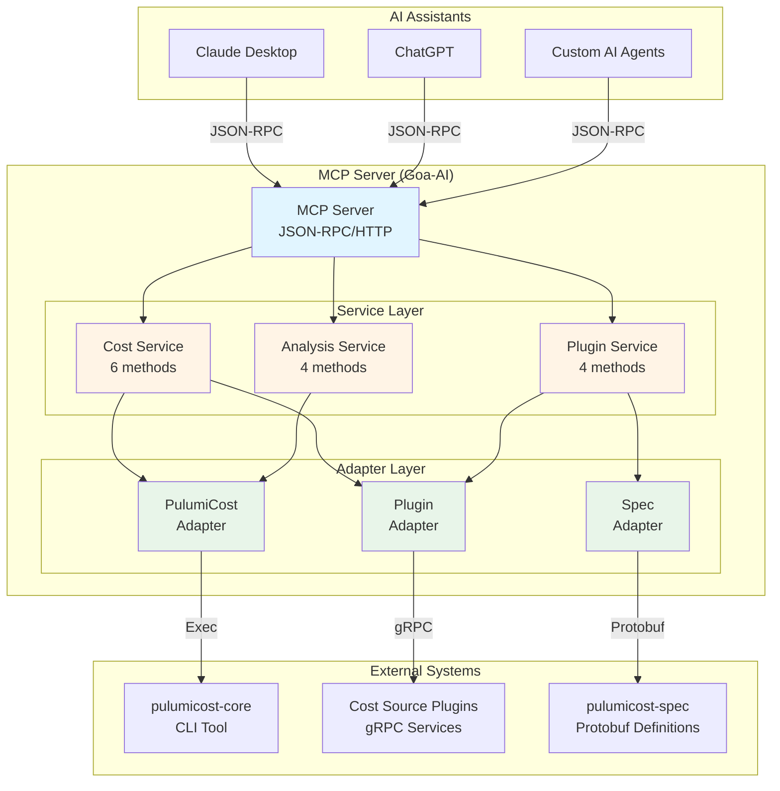
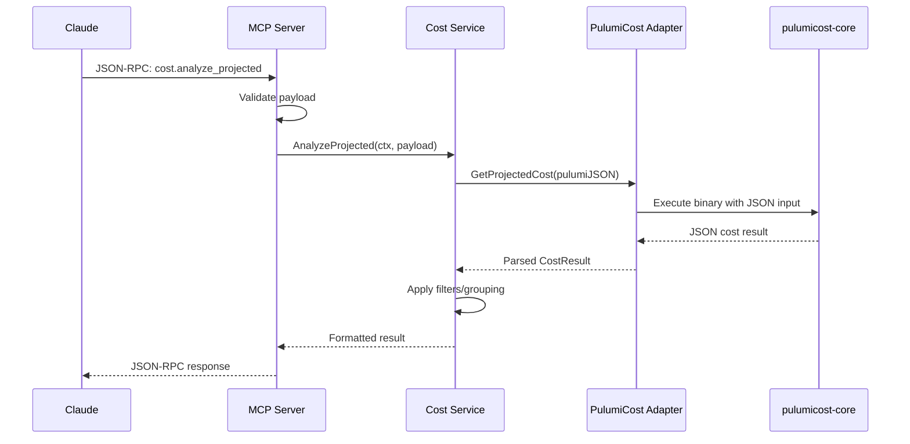
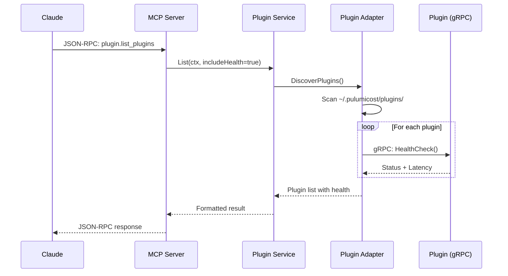
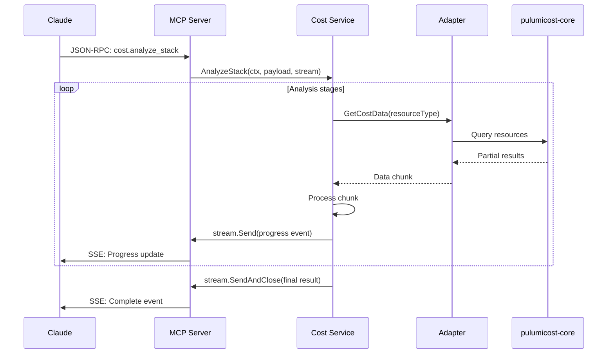

# PulumiCost MCP Server - Architecture Overview

## High-Level Architecture



## Component Breakdown

### 1. MCP Server Layer

The MCP server is generated by Goa-AI and provides:

- **JSON-RPC Transport**: Standard MCP protocol communication
- **HTTP/SSE**: RESTful HTTP with Server-Sent Events for streaming
- **Tool Registration**: Automatic MCP tool discovery and registration
- **Type Safety**: All inputs/outputs validated by generated code

**Key Files**:

- `gen/mcp/` - Generated MCP protocol bindings
- `gen/jsonrpc/` - Generated JSON-RPC server
- `gen/http/` - Generated HTTP transport
- `cmd/pulumicost-mcp/main.go` - Server entry point

### 2. Service Layer

Business logic implementing the 14 MCP tools across 3 services:

#### Cost Service (6 tools)

```
analyze_projected_cost    → AnalyzeProjected(ctx, payload) → CostResult
get_actual_cost          → GetActual(ctx, payload) → CostResult
compare_costs            → CompareCosts(ctx, payload) → ComparisonResult
analyze_resource_cost    → AnalyzeResource(ctx, payload) → ResourceAnalysis
query_cost_by_tags       → QueryByTags(ctx, payload) → TagCostResult
analyze_stack           → AnalyzeStack(ctx, payload, stream) → streaming
```

#### Plugin Service (4 tools)

```
list_plugins     → List(ctx, payload) → PluginList
get_plugin_info  → GetInfo(ctx, payload) → PluginInfo
validate_plugin  → Validate(ctx, payload) → ValidationReport
health_check     → HealthCheck(ctx, payload) → HealthStatus
```

#### Analysis Service (4 tools)

```
get_recommendations  → GetRecommendations(ctx, payload) → Recommendations
detect_anomalies     → DetectAnomalies(ctx, payload) → Anomalies
forecast_costs       → Forecast(ctx, payload) → Forecast
track_budget         → TrackBudget(ctx, payload) → BudgetStatus
```

**Key Files**:

- `internal/service/cost_service.go`
- `internal/service/plugin_service.go`
- `internal/service/analysis_service.go`

### 3. Adapter Layer

Adapters isolate external dependencies and provide clean interfaces:

#### PulumiCost Adapter

Interfaces with pulumicost-core CLI tool:

```go
type PulumiCostAdapter interface {
    GetProjectedCost(ctx, pulumiJSON) → CostResult
    GetActualCost(ctx, stackName, timeRange) → CostResult
}
```

Responsibilities:

- Execute pulumicost-core binary
- Parse JSON output
- Handle errors and timeouts
- Map to internal types

#### Plugin Adapter

Manages gRPC connections to cost source plugins:

```go
type PluginAdapter interface {
    DiscoverPlugins(ctx) → []Plugin
    GetPluginInfo(ctx, name) → PluginInfo
    CallPlugin(ctx, name, request) → response
    HealthCheck(ctx, name) → HealthStatus
}
```

Responsibilities:

- Plugin discovery (filesystem scan)
- gRPC connection management
- Health monitoring
- Circuit breaker patterns
- Connection pooling

#### Spec Adapter

Handles pulumicost-spec protobuf definitions:

```go
type SpecAdapter interface {
    ValidatePlugin(ctx, pluginPath, level) → ValidationReport
    RunConformanceTests(ctx, plugin) → TestResults
}
```

Responsibilities:

- Load protobuf schemas
- Run conformance tests
- Validate plugin implementations
- Generate validation reports

**Key Files**:

- `internal/adapter/pulumicost_adapter.go`
- `internal/adapter/plugin_adapter.go`
- `internal/adapter/spec_adapter.go`

## Data Flow Diagrams

### Cost Query Flow



### Plugin Management Flow



### Streaming Analysis Flow



## Deployment Architecture

### Standalone Deployment

```
┌─────────────────────────────────────────┐
│          User's Machine                  │
│                                          │
│  ┌────────────────┐                     │
│  │ Claude Desktop │                     │
│  │                │                     │
│  │  MCP Client    │                     │
│  └────────┬───────┘                     │
│           │                              │
│           │ JSON-RPC (stdio/HTTP)       │
│           ▼                              │
│  ┌────────────────────┐                 │
│  │ pulumicost-mcp     │                 │
│  │                    │                 │
│  │ • Cost Service     │                 │
│  │ • Plugin Service   │                 │
│  │ • Analysis Service │                 │
│  └────────┬───────────┘                 │
│           │                              │
│           ├──────────┬──────────┬───────┤
│           ▼          ▼          ▼       │
│  ┌─────────────┐ ┌─────┐  ┌─────────┐  │
│  │pulumicost   │ │Plugin│  │Plugin   │  │
│  │-core binary │ │ gRPC │  │ gRPC    │  │
│  └─────────────┘ └─────┘  └─────────┘  │
└─────────────────────────────────────────┘
```

### Distributed Deployment

```
┌──────────────┐                    ┌─────────────────┐
│ Claude       │                    │ Remote Server   │
│ Desktop      │                    │                 │
│              │                    │ ┌─────────────┐ │
│ MCP Client   │  HTTPS/JSON-RPC   │ │ MCP Server  │ │
│              ├────────────────────┤ │             │ │
└──────────────┘                    │ └──────┬──────┘ │
                                    │        │         │
                                    │   ┌────▼─────┐  │
                                    │   │ Services │  │
                                    │   └────┬─────┘  │
                                    │        │         │
                                    │   ┌────▼─────┐  │
                                    │   │ Adapters │  │
                                    │   └──┬───┬───┘  │
                                    └──────┼───┼──────┘
                                           │   │
                     ┌─────────────────────┘   └──────────┐
                     ▼                                     ▼
            ┌────────────────┐                   ┌─────────────┐
            │ pulumicost-core│                   │   Plugins   │
            │                │                   │   (gRPC)    │
            │  • Local exec  │                   │             │
            │  • Or remote   │                   │ • AWS CUR   │
            │    service     │                   │ • Azure CM  │
            └────────────────┘                   │ • Infracost │
                                                 └─────────────┘
```

## Technology Stack Details

### Core Framework

- **Goa v3.22.6**: Design-first API framework
  - DSL-driven development
  - Automatic code generation
  - Type-safe interfaces

- **Goa-AI v0.1.0**: AI extensions for Goa
  - MCP protocol support
  - Tool registration
  - JSON-RPC transport

- **mcp-go v0.42.0**: Go MCP implementation
  - Protocol primitives
  - Client/server utilities
  - Message encoding

### Communication Protocols

- **JSON-RPC 2.0**: Request/response protocol
  - Standard MCP transport
  - Batch requests supported
  - Error handling

- **Server-Sent Events (SSE)**: Streaming updates
  - Real-time progress updates
  - One-way server → client
  - HTTP-based

- **gRPC**: Plugin communication
  - High-performance RPC
  - Protobuf serialization
  - Bidirectional streaming

### Testing Stack

- **Testing**: Go standard library `testing`
- **Assertions**: `testify/assert` and `testify/require`
- **Coverage**: `go test -cover` with 83.9% target
- **Mocking**: Interface-based mocking

### Development Tools

- **golangci-lint v2.6.0**: Comprehensive linting
  - 40+ enabled linters
  - Custom configuration
  - Pre-commit hooks

- **GitHub Actions**: CI/CD automation
  - Test automation
  - Cross-platform builds
  - Release management

## Design Patterns

### 1. Design-First Development

All APIs defined in Goa DSL before implementation:

```go
// design/cost_service.go
Method("analyze_projected", func() {
    Description("Calculate projected costs")
    Payload(AnalyzeProjectedPayload)
    Result(CostResult)
    Error("validation_error", ValidationError)
    Error("internal_error", InternalError)
    mcp.Tool("analyze_projected_cost", "...")
    JSONRPC(func() {})
})
```

Benefits:

- Contract-first development
- Automatic validation
- No schema drift
- Compiler-verified integration

### 2. Adapter Pattern

Isolation of external dependencies:

```go
// Business logic depends on interface
type CostService struct {
    adapter PulumiCostAdapter  // Interface, not concrete type
}

// Interface defined by business needs
type PulumiCostAdapter interface {
    GetProjectedCost(ctx, json) → result
}

// Concrete implementation can change
type cliAdapter struct { ... }
type httpAdapter struct { ... }
type mockAdapter struct { ... }
```

Benefits:

- Testability (mock adapters)
- Flexibility (swap implementations)
- Isolation (external changes don't affect core)

### 3. Dependency Injection

Constructor-based injection for clean testing:

```go
// Service constructor
func NewCostService(
    adapter PulumiCostAdapter,
    logger *log.Logger,
    cache Cache,
) *costService {
    return &costService{
        adapter: adapter,
        logger: logger,
        cache: cache,
    }
}

// Testing with mocks
service := NewCostService(
    mockAdapter,
    testLogger,
    nilCache,
)
```

### 4. Context Propagation

All operations support cancellation:

```go
func (s *service) Method(ctx context.Context, ...) error {
    // Respect context cancellation
    select {
    case <-ctx.Done():
        return ctx.Err()
    case result := <-ch:
        return nil
    }
}
```

### 5. Streaming Pattern

Real-time updates for long operations:

```go
func (s *service) AnalyzeStack(
    ctx context.Context,
    payload *Payload,
    stream AnalyzeStackServerStream,
) error {
    for i, stage := range stages {
        // Send progress
        stream.Send(&AnalyzeStackResult{
            Progress: float64(i) / float64(len(stages)) * 100,
            Status: stage.name,
        })

        // Check cancellation
        select {
        case <-ctx.Done():
            return ctx.Err()
        default:
        }
    }

    return stream.SendAndClose(finalResult)
}
```

## Security Considerations

### 1. Input Validation

All inputs validated by generated Goa code:

- Type checking
- Required field validation
- Enum validation
- Range validation

### 2. Error Handling

Errors mapped to appropriate HTTP/RPC status codes:

- `ValidationError` → 400 Bad Request
- `NotFoundError` → 404 Not Found
- `InternalError` → 500 Internal Server Error

### 3. Resource Limits

- Request timeout: 30s default
- Max message size: 10MB
- Concurrent plugin connections: 10

### 4. Plugin Isolation

- Plugins run as separate processes
- Communication via gRPC only
- Health checks with circuit breakers
- Timeouts on all plugin calls

## Performance Characteristics

### Latency

- **MCP request overhead**: ~5-10ms
- **Service logic**: ~10-50ms (excluding external calls)
- **pulumicost-core execution**: 500ms-5s (varies by complexity)
- **Plugin gRPC calls**: 10-100ms (varies by plugin)

### Throughput

- **MCP server**: 100+ req/s (with caching)
- **Without caching**: 10-20 req/s (limited by external tools)
- **Streaming**: 10-50 events/s

### Memory Usage

- **Base server**: ~50MB
- **Per request**: ~1-5MB
- **Cache (if enabled)**: 100MB-1GB (configurable)

### Scalability

**Vertical Scaling**:

- CPU: Benefits from more cores (concurrent requests)
- Memory: Primarily for caching
- Disk: Minimal (logs only)

**Horizontal Scaling**:

- Stateless design allows multiple instances
- Load balancer required
- Shared cache layer recommended

## Error Recovery

### 1. Plugin Failures

```
Plugin unavailable → Health check fails → Circuit breaker opens
→ Return cached data or error to user → Retry after backoff
```

### 2. pulumicost-core Failures

```
Execution fails → Parse stderr → Map to appropriate error type
→ Return user-friendly error → Log for debugging
```

### 3. Network Failures

```
gRPC connection lost → Detect via health check → Mark plugin unhealthy
→ Retry with exponential backoff → Fail gracefully after 3 attempts
```

## Monitoring & Observability

### Metrics (Planned)

- Request count by tool
- Request duration by tool
- Error rate by type
- Plugin health status
- Cache hit rate

### Logging

- Structured JSON logging
- Configurable levels: DEBUG, INFO, WARN, ERROR
- Request ID tracking
- Plugin call tracing

### Tracing (Planned)

- OpenTelemetry integration
- End-to-end request tracing
- Plugin call spans
- External tool execution tracking

## Configuration Management

### Environment Variables

```bash
MCP_SERVER_PORT=8080
MCP_SERVER_HOST=localhost
MCP_LOG_LEVEL=info
PULUMICOST_CORE_PATH=/usr/local/bin/pulumicost
PULUMICOST_PLUGIN_DIR=~/.pulumicost/plugins
PLUGIN_TIMEOUT=30s
```

### Configuration File

```yaml
# config.yaml
server:
  port: 8080
  host: localhost
  log_level: info

pulumicost:
  core_path: /usr/local/bin/pulumicost
  plugin_dir: ~/.pulumicost/plugins

plugins:
  timeout: 30s
  max_concurrent: 10
  health_check_interval: 60s

mcp:
  enable_streaming: true
  max_message_size: 10485760
```

## Directory Structure

```
pulumicost-mcp/
├── design/                  # Goa DSL (source of truth)
│   ├── design.go           # MCP server configuration
│   ├── cost_service.go     # Cost service definition
│   ├── plugin_service.go   # Plugin service definition
│   ├── analysis_service.go # Analysis service definition
│   └── types.go            # Shared type definitions
│
├── cmd/
│   └── pulumicost-mcp/     # Server entry point
│       └── main.go         # Initialize and start server
│
├── internal/
│   ├── service/            # Business logic
│   │   ├── cost_service.go
│   │   ├── plugin_service.go
│   │   └── analysis_service.go
│   │
│   ├── adapter/            # External integrations
│   │   ├── pulumicost_adapter.go
│   │   ├── plugin_adapter.go
│   │   └── spec_adapter.go
│   │
│   └── config/             # Configuration management
│       ├── config.go
│       └── config_test.go
│
├── gen/                    # Generated code (DO NOT EDIT)
│   ├── cost/              # Cost service types
│   ├── plugin/            # Plugin service types
│   ├── analysis/          # Analysis service types
│   ├── http/              # HTTP transport
│   ├── jsonrpc/           # JSON-RPC transport
│   └── mcp/               # MCP protocol bindings
│
├── test/
│   └── e2e/               # End-to-end tests
│
├── docs/
│   ├── architecture/      # Architecture documentation
│   ├── guides/            # User and developer guides
│   └── api/               # API reference
│
└── examples/
    ├── pulumi-stacks/     # Example Pulumi projects
    ├── queries/           # Example MCP queries
    └── claude-desktop/    # Claude Desktop config examples
```

## Future Enhancements

### Phase 1 (Current)

- ✅ Core services implemented
- ✅ Mock data for all tools
- ✅ Claude Desktop integration
- ✅ Comprehensive documentation

### Phase 2 (Next Quarter)

- [ ] Real pulumicost-core integration
- [ ] Plugin gRPC implementation
- [ ] Caching layer
- [ ] Advanced filtering

### Phase 3 (Future)

- [ ] Multi-cloud support expansion
- [ ] Real-time cost streaming
- [ ] Advanced ML-based recommendations
- [ ] Cost anomaly prediction
- [ ] Budget auto-adjustment

### Phase 4 (Long-term)

- [ ] Distributed tracing
- [ ] Metrics and monitoring
- [ ] Horizontal scaling support
- [ ] Plugin marketplace
- [ ] Advanced visualization

## See Also

- [MCP Tools Reference](../guides/mcp-tools.md) - Detailed tool documentation
- [Developer Guide](../guides/developer-guide.md) - Development setup
- [Plugin Development](../guides/plugin-development.md) - Building plugins
- [API Reference](../api/) - Complete API documentation
- [Goa Documentation](https://goa.design) - Framework documentation
- [MCP Specification](https://modelcontextprotocol.io) - Protocol specification
